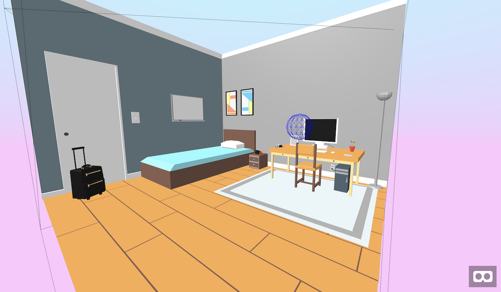

# A-Frame Resonance Component

Rich, Immersive, Audio
With Resonance Audio, bring dynamic spatial sound into your VR, AR, gaming, or video experiences at scale.

Based on [Google Resonance Audio project](https://developers.google.com/resonance-audio/)



## Demo

#### [👉👉 Live demo 😎 👈👈](https://etiennepinchon.github.io/aframe-resonance/)


## Getting Started

Here is the code from the demo. That is it. Pure html!

```html
<a-resonance-room
  src-position="0.85 1.5 -0.7"
  src="static/track.mp3"
  loop="true",
  autoplay="true",
  width="4"
  height="3"
  depth="3.8"
  helper="true"
  left-wall="brick-bare"
  right-wall="curtain-heavy"
  front-wall="marble"
  back-wall="glass-thin"
  down-wall="marble"
  up-wall="brick-bare"
  ><a-resonance-room>
```

## 👉👉 Install 👈👈

```html
<head>
  <!--  
    ... MORE HEAD STUFF ...
  -->
  <script src="https://aframe.io/releases/0.7.0/aframe.min.js"></script>
  <script src="https://cdn.jsdelivr.net/npm/resonance-audio/build/resonance-audio.min.js"></script>
  <script src="https://aframe.io/releases/0.7.0/aframe.min.js"></script>
</head>
```

-----------------------------------------------

# Documentation 🙌

### Attributes

| Name | Description | Type | Default |
| --- | --- | --- | --- |
| helper | Show a helpers for the room and source. | boolean | false |
| src-position | Position of the audio source in the room. | vec3 | 0 0 0 |
| src | Path to audio file | string | "" |
| loop | Whether the audio should loop. | boolean | true |
| autoplay | Whether the audio should autoplay | boolean | true |
| width | Width of the room. | number | 2 |
| height | Height of the room. | number | 2 |
| depth | Depth of the room. | number | 2 |
| left-wall | Materials to apply on the left wall. | string | brick-bare |
| right-wall | Materials to apply on the right wall. | string | brick-bare |
| front-wall | Materials to apply on the front wall. | string | brick-bare |
| back-wall | Materials to apply on the back wall. | string | brick-bare |
| down-wall | Materials to apply on the down wall. | string | brick-bare |
| up-wall | Materials to apply on the up wall. | string | brick-bare |

### Currently supported wall materials are:

* transparent
* acoustic-ceiling-tiles
* brick-bare
* brick-painted
* concrete-block-coarse
* concrete-block-painted
* curtain-heavy
* fiber-glass-insulation
* glass-thin
* glass-thick
* grass
* linoleum-on-concrete
* marble
* metal
* parquet-on-concrete
* plaster-smooth
* plywood-panel
* polished-concrete-or-tile
* sheetrock
* water-or-ice-surface
* wood-ceiling'
* wood-panel
* uniform

# Use in script

The audio source (regular HTML audio player) can be found in the element as `audioEl`.

```html
<script type="text/javascript">
  let el = document.querySelector('a-resonance-room');
  el.audioEl.pause();
</script>
```

## Want to make some changes to it?

### Installation

First make sure you have Node installed.

On Mac OS X, it's recommended to use [Homebrew](http://brew.sh/) to install Node + [npm](https://www.npmjs.com):

    brew install node

To install the Node dependencies:

    npm install


### Local Development

To serve the site from a simple Node development server:

    npm start

Then launch the site from your favourite browser:

[__http://localhost:3000/__](http://localhost:3000/)

If you wish to serve the site from a different port:

    PORT=8000 npm start

## Acknowledgement

Google 😍😝

## License

Distributed under an [MIT License](LICENSE).
